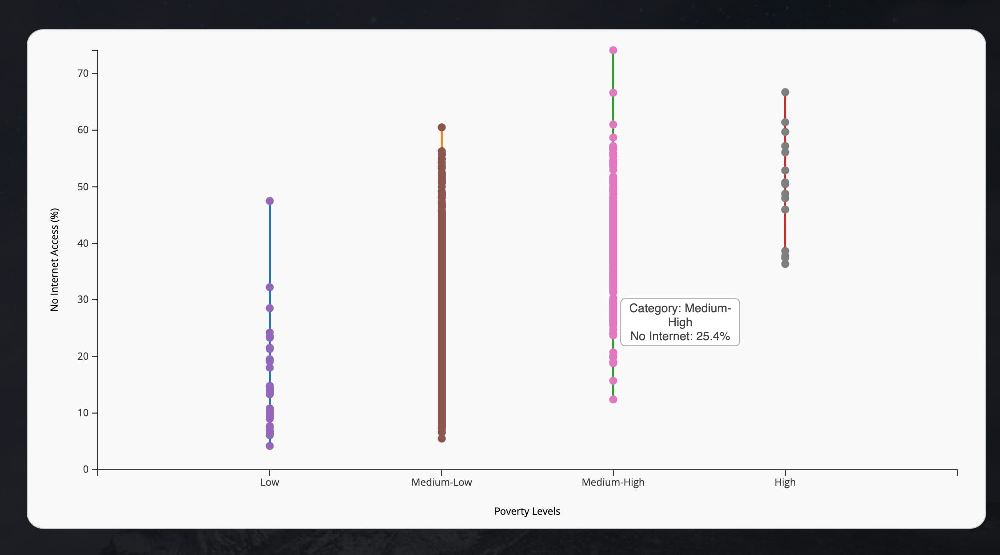
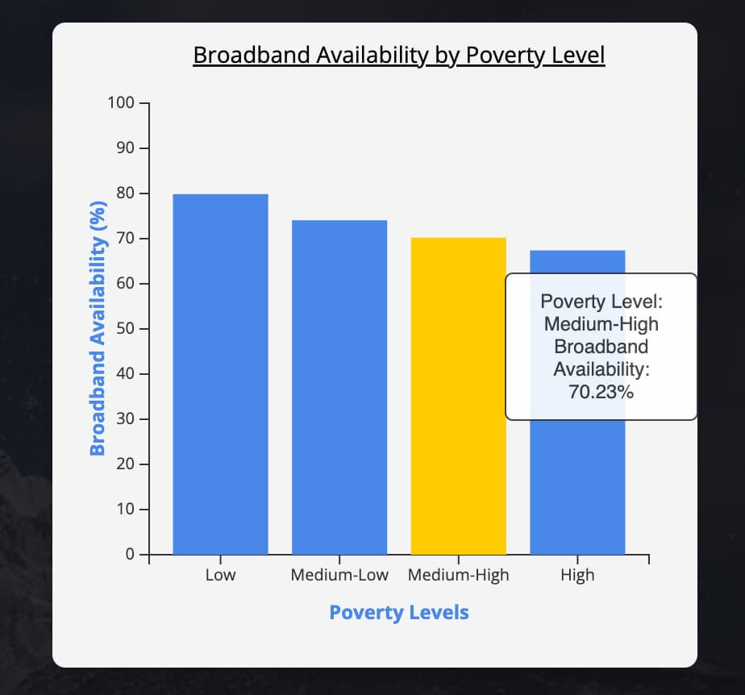
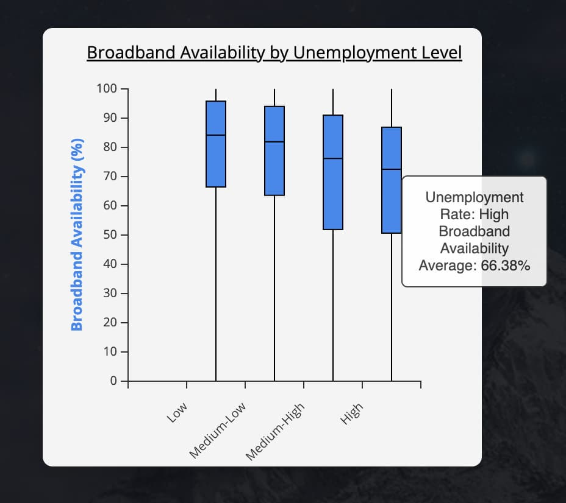

# Final Project: Visualization of Internet Access Disparities

#### Project Link: [Keep us connected - The fight for universal internet](https://oihamza.github.io/)

### Introduction

For my final project, I aimed to create a visualization that highlights the disparity between lack of internet and broadband access with poverty and unemployment rates. My goal was to illustrate that these factors are intertwined and to emphasize that internet access is essential as a human right.

### Motivation

I embarked on this project because the topic of internet accessibility is deeply personal to me. The government's launch of the Affordable Connectivity Program (ACP) was a significant step forward. This program helped millions of disadvantaged Americans gain affordable internet access, providing them with credits towards their monthly bills. The program was widely adopted, and internet providers could easily accept participants.

Unfortunately, the program is winding down due to a lack of funding. This is not because the program failed or was ineffective, but because it didn't pass the house vote for funding. This decision was frustrating, as millions of Americans rely on this program to stay connected in our ever-evolving digital world. The purpose of this project is to raise awareness about the ACP and encourage people to contact their local representatives to pressure those in charge to fund the ACP. 

### Data

I chose to use data from the Institute of Museum and Library Services (IMLS), specifically a dataset from the [Economic Status and Broadband Availability and Adoption](https://www.imls.gov/data/data-catalog/imls-indicators-workbook-economic-status-and-broadband-availability-and-adoption). This dataset contained the fields I needed: poverty levels, unemployment rates, and internet accessibility metrics. The dataset also provided a clear picture of the digital divide, making it ideal for my project and argument. The visualizations I created using **D3.js**, included on the "Internet Impact" page of the project, highlight how poverty and unemployment are tied to the lack of internet access.

### Design Decisions

#### Visualization Choices

1. **Line Graph**
    - **Purpose**: To demonstrate the correlation between poverty rates and lack of internet connectivity.
    - **Design Impact**: The line graph effectively highlights the digital divide faced by economically disadvantaged communities. The clear visual separation of data points allows viewers to easily grasp the severity of the issue.

2. **Bar Graph**
    - **Purpose**: To illustrate the inverse relationship between economic status and broadband access.
    - **Design Impact**: The bar graph emphasizes the struggles faced by economically disadvantaged communities in securing reliable internet. The visual contrast between different economic statuses makes the disparity clear and impactful.

3. **Boxplot**
    - **Purpose**: To show that higher unemployment rates often coincide with sporadic and inadequate broadband access.
    - **Design Impact**: The boxplot suggests a cyclical relationship where poor internet connectivity can both contribute to and result from higher unemployment rates. The statistical representation helps in understanding the variability and central tendency of the data.

#### Interactivity and Engagement

- **Tooltips**: I added tooltips to enhance user engagement and provide additional context. When users hover over data points, they receive more detailed information, which helps them understand the data better.
- **Axis Labels**: Clear and descriptive axis labels were added to ensure that the visualizations are easily interpretable. This is crucial for viewers to understand the relationship between the variables at a glance.

#### Comparative Analysis

I also included examples of similar programs in other countries, such as South Korea, Australia, and the UK. These countries have initiatives to help their less fortunate members remain connected, demonstrating that the US is lagging behind in this area. This comparative analysis underscores the need for the ACP and positions the US in a global context, showing that it is not leading in this crucial area.

### Call to Action

At the end of the project, I include a call to action urging viewers to contact their elected leaders to raise awareness about this issue. By doing so, I hope to ensure that people pay attention to this critical issue and hold their representatives accountable for supporting essential services like the ACP. 

This project is designed to not only present data but to tell a compelling story about the importance of internet access. Through carefully crafted visualizations and interactivity, the project aims to engage viewers and motivate them to advocate for the continuation and funding of the ACP. 

By providing a clear and structured presentation, this project hopes to make a significant impact on public awareness and policy advocacy, ensuring that internet access remains a fundamental right for all.